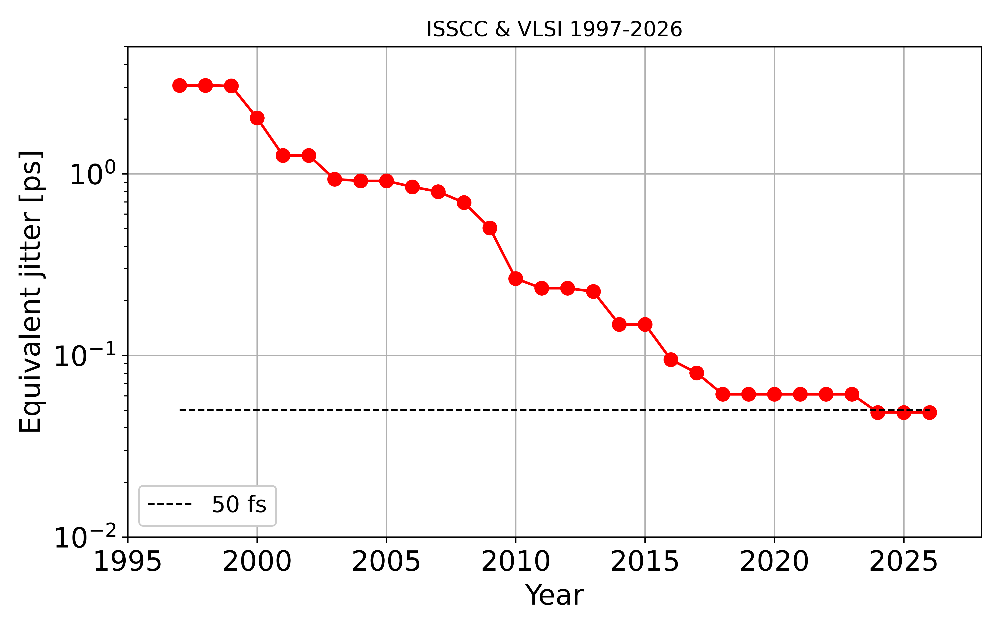
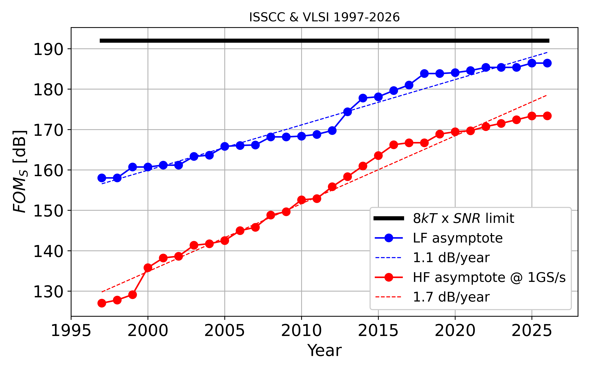

This directory provides some examples for plotting the ADC survey data. The Jupyter notebooks can be opened and run in Google Colab (no local Jupyter installation needed). You can click the examples below to download high-resolution png files.

**Aperture Plot**: Signal-to-noise and distortion ratio (SNDR) versus input frequency (fin,hf). For these data points, the input frequency is typically chosen as the highest reported, often near fs/2. In this case, high-speed converters are often limited by clock jitter, and it is reasonable to use the measured SNDR as a proxy for the SNR caused by jitter alone. We see that today's best designs get close to an equivalent jitter of approximately 50 fs.  

 

**Aperture Trend Plot**: The plot below shows the progression of the equivalent jitter over time. The best 3 designs to date are averaged for each data point. The value of 50 fs was reached in the late 2010s but hasn't progressed much since. Generating and distributing a sampling clock with significantly lower jitter remains a grand challenge for A/D interfaces. 

 

**Energy Plot**: A/D conversion energy (power/sampling rate) versus signal-to-noise and distortion ratio (SNDR). Designs with high SNDR are typically limited by thermal noise and we expect the energy to quadruple per added bit. The data confirms this with a good fit to 4ENOB (where ENOB=SNDR-1.76/6.02) for high SNDR. For low SNDR, the energy tends to plateau at some level set by CV2 limits (as opposed to energy invested to overcome noise). Process technology scaling and reduced supply voltages can help with lowering the horizontal asymptote. The colors of each point give an indication of the conversion speed. Low-speed designs tend to have lower energy at a given SNDR. The lowest absolute energy points on this chart correspond (not surprisingly) to ADCs that have neither high resolution nor high speed.

**Figure of Merit Plot**: The above Energy Plot indicates that high-speed ADCs tend to be less energy efficient. To visualize this tradeoff more directly, we can lump the relevant metrics into a figure of merit (FOM). Shown below is a plot of the SNDR-based Schreier FOM ($FOM_S=SNDR(dB)+10log(f_{snyq}/2/P)$) versus sampling rate. (Larger is better in this plot.) FOMS conforms with the asymptotic cost of 4x in power per 6 dB of SNDR increase, seen in the above Energy Plot. It also assumes that power scales linearly with conversion speed. The plot shows that this latter assumption breaks down at some corner frequency (near 100 MHz), beyond which the FOM drops by about 10 dB per decade. This suggests a quadratic relationship between power and conversion speed in this high-speed region. Using the envelope data of this plot, one can estimate the power dissipation of a state-of-the-art ADC for a given SNDR requirement and conversion speed. Try it out using this [calculator](https://murmann-group.github.io/adc_survey/).

 

**Figure of Merit Trend Plot**: The plot below shows the improvement in $FOM_S$ over time. The best 5 designs to date are averaged for each data point. The blue line is for the horizontal (low-frequency) asymptote in the Figure of Merit Plot. The red curve is for the high-frequency asymptote, evaluated at 1 GHz. We observe that low-speed designs are just a few decibels away from the classical $8kT$ x $SNR$ limit for an ideal class-B analog circuit. The $FOM_S$ improvement rate for both high- and low-speed designs has been in the range of 1-2 dB.

 
