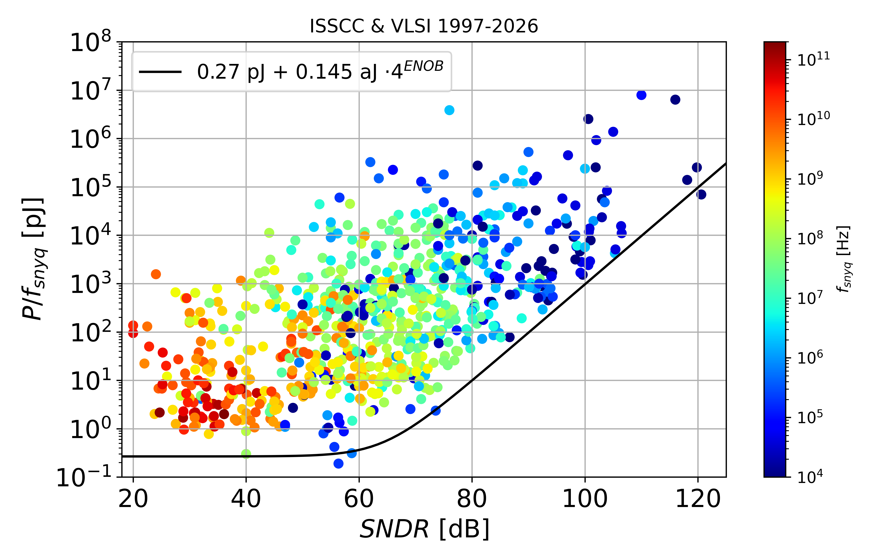
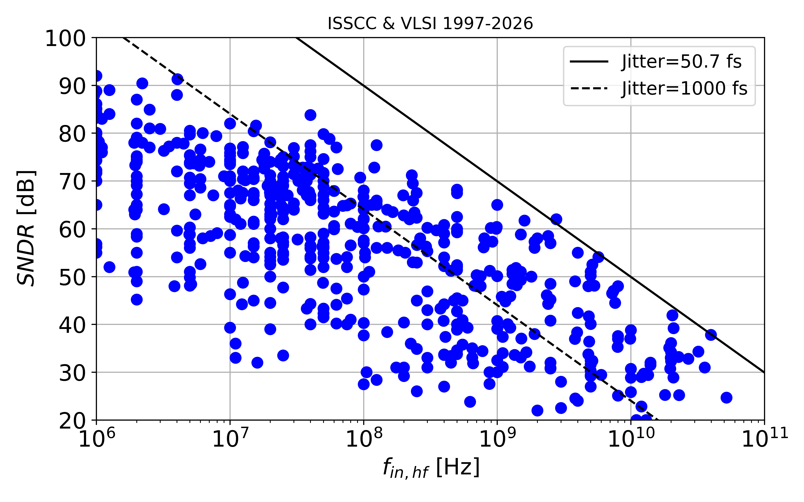
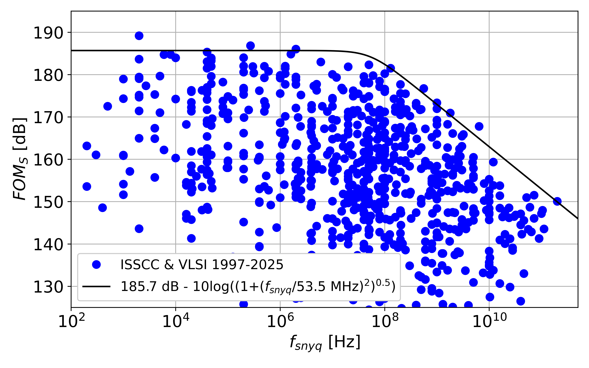

This directory provides some examples for plotting the ADC survey data. The Jupyter notebooks can be opened and run in Google Colab (no local Jupyter installation needed). You can click the examples below to download high-resolution png files.

**Energy plot**: A/D conversion energy (power/sampling rate) versus signal-to-noise and distortion ratio (SNDR). Designs with high SNDR are typically limited by thermal noise and we expect the energy to quadruple per added bit. The data confirms this with a good fit to 4ENOB (where ENOB=SNDR-1.76/6.02) for high SNDR. For low SNDR, the energy tends to plateau at some level set by CV2 limits (as opposed to energy needed to overcome noise). Process technology scaling and reduced supply voltages can help with lowering the horizontal asymptote.

**Aperture plot**: Signal-to-noise and distortion ratio (SNDR) versus input frequency (fin,hf). For these data points, the input frequency is typically chosen as the highest reported, often near fs/2. In this case, high-speed converters are usually limited by clock jitter, and it is reasonable to use the measured SNDR as a proxy for SNR. We see that the best designs get close to an equivalent jitter of approximately 50 fs. It is a grand challenge to generate and distribute a clock with lower jitter in electronic circuits.

 

**Figure of Merit plot**: The above energy plot is useful for assessing the minimum energy needed for an A/D conversion at a given SNDR. This neglects speed requirements and specifically the fact that ADCs with higher speed tend to have a lower energy efficiency. To illustrate this tradeoff in a single diagram, we either need a 3D plot (who likes 3D plots?) or a way to lump the relevant metrics into a figure of merit (FOM). Shown below is a plot of the SNDR-based Schreier FOM ($FOM_S=SNDR(dB)+10log(f_{snyq}/2/P)$) versus sampling rate. (Larger is better in this plot.) FOMS conforms with the asymptotic cost of 4x in power per 6 dB of SNDR increase, seen in the above energy plot. It also assumes that power scales linearly with conversion speed. The plot shows that this breaks down at some corner frequency (close to 100 MHz), beyond which the FOM drops by 10 dB per decade. This can be assimilated to a quadratic relationship between power and conversion speed in this high-speed region.

 

Using the envelope data of this plot, one can estimate the power dissipation of a state-of-the-art ADC for a given SNDR requirement and conversion speed. Try it out using this [calculator](https://murmann-group.github.io/adc_survey/).

