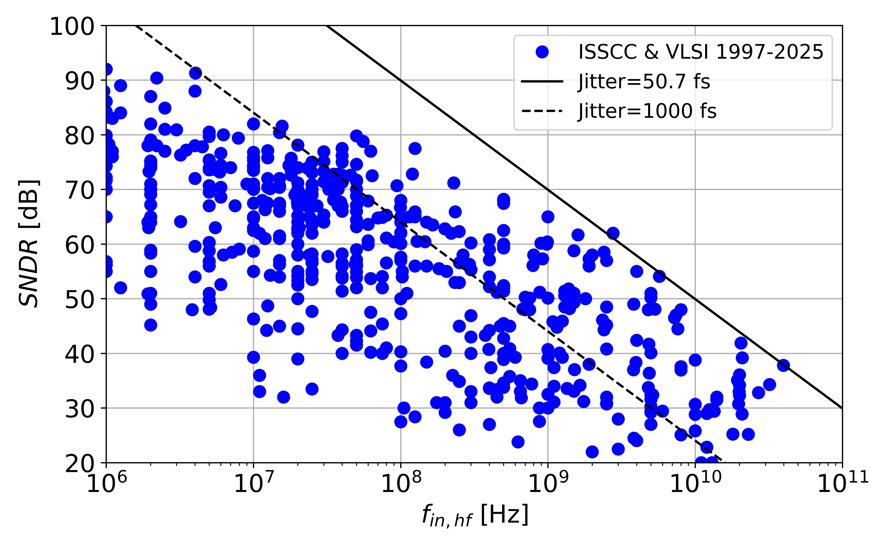

This directory provides some examples for plotting the ADC survey data. The Jupyter notebooks can be opened and run in Google Colab (no local Jupyter installation needed). You can click the examples below to download high-resolution png files.

**Energy plot**: A/D conversion energy (power/sampling rate) versus signal-to-noise and distortion ratio (SNDR). Designs with high SNDR are typically limited by thermal noise and we expect the energy to quadruple per added bit. The data confirms this with a good fit to 4ENOB (where ENOB=SNDR-1.76/6.02) for high SNDR. For low SNDR, the energy tends to plateau at some level set by CV2 limits (as opposed to energy needed to overcome noise). Process technology scaling can help with lowering the horizontal asymptote.

**Aperture plot**: Signal-to-noise and distortion ratio (SNDR) versus input frequency (fin,hf). For these data points, the input frequency is typically chosen as the highest reported, often near fs/2. In this case, high-speed converters are usually limited by clock jitter, and it is reasonable to use the measured SNDR as a proxy for SNR. We see that the best designs get close to an equivalent jitter of approximately 50 fs. It is a grand challenge to generate and distribute a clock with lower jitter in with electronic circuits.

 
